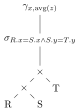

## Why CS 143?

What's the [most popular programming language](https://spectrum.ieee.org/the-rise-of-sql)?

How many databases are out there? ([1 trillion sqlite DB](https://sqlite.org/mostdeployed.html))

How old is the oldest DB? ([~3500 BC](https://en.wikipedia.org/wiki/Kish_tablet), 5k years old)

DB's fun:

- Rite of passage of a systems hacker: write a compiler, write an OS, write a DB
- Beautiful [algorithms & theory](http://webdam.inria.fr/Alice/)

## Trying things out

[SQL playground](https://sqlime.org)

You might also have `sqlite` already installed on your computer.

If running in terminal, remember to add semicolon `;` at the end of each query.

First, `CREATE TABLE t (x int, y int)`

Add data by `INSERT INTO t VALUES (1, 5), (2, 4), (3, 3), (4, 2), (5, 1)`

Check with `SELECT * FROM t` (`*` = all the columns)

To remove rows, `DELETE FROM t WHERE x = 1 AND y = 5` (how do you delete all rows?)

To remove table, `DROP TABLE t`

## Basic SQL

What do the following queries return given input?

| x | y |
| - | - |
| 1 | 5 |
| 2 | 4 |
| 3 | 3 |
| 4 | 2 |
| 5 | 1 |

```{.sql .run template="#setup-basic"}
SELECT x
  FROM t
 WHERE x < 3
```

```{.sql .run template="#setup-basic"}
SELECT x, y
  FROM t
 WHERE y < 3
```

```{.sql .run template="#setup-basic"}
SELECT x
  FROM t
 WHERE y < 3
```

```{.sql .run template="#setup-basic"}
SELECT x+1
  FROM t
 WHERE y < 3
```

```{.sql .run template="#setup-basic"}
SELECT x+y
  FROM t
 WHERE y < 3
```

```{.sql .run template="#setup-basic"}
SELECT x+y
  FROM t
 WHERE NOT y < 3
```

```{.sql .run template="#setup-basic"}
SELECT x+y
  FROM t
 WHERE y < 3 AND x > 1
```

```{.sql .run template="#setup-basic"}
SELECT x+y
  FROM t
 WHERE y < 3 OR x > 1
```

General form:
```sql
SELECT e(x, y)
  FROM table
 WHERE cond(x, y)
```

Meaning:

```python
for (x, y) in table:
  if cond(x, y):
    print(e(x, y))
```

## Aggregates

```{.sql .run template="#setup-basic"}
SELECT SUM(x) FROM t
```

```{.sql .run template="#setup-basic"}
SELECT MIN(x) FROM t
```

```{.sql .run template="#setup-basic"}
SELECT MAX(x) FROM t
```

```{.sql .run template="#setup-basic"}
SELECT AVG(x) FROM t
```

```{.sql .run template="#setup-basic"}
SELECT COUNT(x) FROM t
```

Aggregate by groups:

| x | y |
| - | - |
| 1 | 5 |
| 2 | 4 |
| 3 | 3 |
| 1 | 2 |
| 2 | 1 |

```SQL
  SELECT ...
    FROM t
GROUP BY x
```

| x | y |
| - | - |
| ? | ? |
| ? | ? |

| x | y |
| - | - |
| ? | ? |
| ? | ? |

| x | y |
| - | - |
| ? | ? |


```{.sql .run template="#setup-agg"}
  SELECT x, SUM(y)
    FROM t
GROUP BY x
```

`GROUP BY` variable (`x`)  **must** be `SELECT`ed, `AGG` function applied per group.

Multiple group-by & aggregate variables

| x | y | z | w |
| - | - | - | - |
| 1 | 1 | 1 | 5 |
| 1 | 1 | 2 | 4 |
| 1 | 2 | 3 | 3 |
| 2 | 3 | 1 | 2 |
| 2 | 3 | 2 | 1 |

```{.sql .run template="#setup-multi-agg"}
  SELECT x, y, MIN(z), MAX(w)
    FROM t
GROUP BY x, y
```

Current general form:

```sql
4:   SELECT x, AGG(y)
1:     FROM t
2:    WHERE cond(x, y)
3: GROUP BY x
```

1. Where's the data `FROM`?
2. Check conditions
3. Group rows
4. Run aggregate & return

## Relational algebra

| Name | Notation | Meaning |
| - | - | - |
| selection | $\sigma_p(t)$ | filter by condition $p$ |
| projection | $\pi_{e(x, y)}(t)$ | map an expression $e$ over $x, y$ |
| aggregation | $\gamma_{x, F(y)}(t)$ | group by $x$, aggregate over $y$ using $F$ |

Can you write out SQL query for each operation?

## More tables

Meet my pets:

| name | toy |
| ---- | --- |
| kira | 🛍️  |
| kira | 🍼  |
| casa | 🍼  |
| casa | 🧻  |

| name | food |
| ---- | ---- |
| kira | 🐟   |
| kira | 🍗   |
| casa | 🥬   |
| casa | 🍗   |

What do these queries return?

```{.sql .run template="#setup-pets"}
SELECT t.name
  FROM t, f
 WHERE t.name = f.name
   AND t.toy = '🛍️'
   AND f.food = '🐟'
```

```{.sql .run template="#setup-pets"}
SELECT t.name
  FROM t, f
 WHERE t.name = f.name
   AND t.toy = '🛍️'
   AND f.food = '🍗'
```

```{.sql .run template="#setup-pets"}
SELECT t.name
  FROM t, f
 WHERE t.name = f.name
   AND t.toy = '🍼'
   AND f.food = '🍗'
```

```{.sql .run template="#setup-pets"}
SELECT t.name
  FROM t, f
 WHERE t.name = f.name
   AND t.toy = '🛍️'
   AND f.food = '🥬'
```

General form for **join**ing tables:

```sql
SELECT ...
  FROM r, s
 WHERE cond
```

Meaning:

```python
for x1, x2, ... in r:
  for y1, y2, ... in s:
    if cond(x1, x2, ..., y1, y2, ...):
      return ...
```

Try all possible pairings of a row from `r` and a row from `s`.
I.e., first compute the *Cartesian product* of `r` and `s` (how many rows does the following query return?):

```{.sql .run template="#setup-pets"}
SELECT *
  FROM t, f
```

```python
for t_row in t:
  for f_row in f:
    return t_row ++ f_row
```

Then evaluate rest of query using result.

In relational algebra: $\sigma_p(t \times f)$, or $t \bowtie_p f$ (the **join**).

Current general form:

```SQL
4.   SELECT R.x, AVG(T.z)
1.     FROM R, S, T
2.    WHERE R.x = S.x AND S.y = T.y
3. GROUP BY R.x
```



## More queries

```
sqlite> SELECT * FROM pets;
┌──────┬───────────────┬─────┬─────────┬──────┬────────┐
│ name │     breed     │ age │ origin  │ kind │ person │
├──────┼───────────────┼─────┼─────────┼──────┼────────┤
│ casa │ tabby         │ 8   │ seattle │ cat  │ remy   │
│ kira │ tuxedo        │ 6   │ hawaii  │ cat  │ remy   │
│ toby │ border collie │ 17  │ seattle │ dog  │ remy   │
│ maya │ husky         │ 10  │ LA      │ dog  │ sam    │
└──────┴───────────────┴─────┴─────────┴──────┴────────┘
```

How to find people with both a cat and a dog?

Attempt 1:

```sql
SELECT pets.person FROM pets
WHERE pets.kind="cat" AND pets.kind="dog";
```

Attempt 2:

```sql
SELECT pets.person FROM pets
WHERE pets.kind="cat" OR pets.kind="dog";
```

Take a step back: how do we find cat people?

```sql
SELECT pets.person FROM pets
WHERE pets.kind="cat";
```

How do we find dog people?

```sql
SELECT pets.person FROM pets
WHERE pets.kind="dog";
```

Guess what this does?

```sql
SELECT pets.person FROM pets
WHERE pets.kind="cat"
INTERSECT
SELECT pets.person FROM pets
WHERE pets.kind="dog";
```

How about this:

```sql
SELECT pets.person FROM pets
WHERE pets.kind="cat"
UNION
SELECT pets.person FROM pets
WHERE pets.kind="dog";
```

## "Variables" in SQL

| SQL                        | Python          |
| -------------------------- | --------------- |
| `WITH`                     | Local variable  |
| `CREATE TABLE`             | Global variable |
| `CREATE VIEW`              | Helper function |
| `CREATE MATERIALIZED VIEW` | Cached helper function |

```sql
CREATE TABLE/(MATERIALIZED) VIEW cat_people AS
SELECT pets.person FROM pets
WHERE pets.kind="cat";
CREATE TABLE/(MATERIALIZED) VIEW dog_people AS
SELECT pets.person FROM pets
WHERE pets.kind="dog";

-- What happens if we run the following query twice?
-- What happens if we insert into `pets` then run the following query?

-- INSERT INTO pets VALUES ("casa", "tabby", 8, "seattle", "cat", "remy");

SELECT cat_people.person FROM cat_people
INTERSECT
SELECT dog_people.person FROM dog_people;
```

`WITH` has a slightly different syntax as it's local to the query:

```sql
WITH cat_people AS (
  SELECT pets.person FROM pets
  WHERE pets.kind="cat"
),   dog_people AS (
  SELECT pets.person FROM pets
  WHERE pets.kind="dog"
)
SELECT cat_people.person FROM cat_people
INTERSECT
SELECT dog_people.person FROM dog_people;
```

How do we find pet kind with average age > 10?
(Hint: find the average age for each kind first, then filter)

Does this work?

```sql
SELECT kind, AVG(age) FROM pets
WHERE AVG(age) > 10
GROUP BY kind;
```

Average age per kind:

```sql
SELECT kind, AVG(age)
FROM pets
GROUP BY kind;
```

Two queries:

```sql
CREATE TABLE averages AS
SELECT kind, AVG(age) AS a
FROM pets
GROUP BY kind;

-- Now we just filter for over 10:
SELECT * FROM averages
WHERE averages.a > 10.0;
```

"One" query:

```sql
WITH averages AS (SELECT kind, AVG(age) AS a FROM pets GROUP BY kind)
SELECT * FROM averages WHERE averages.a > 10.0;
```

ONE query:

```sql
SELECT kind, AVG(age) FROM pets
GROUP BY kind
HAVING AVG(age) > 10 -- condition on each group
```

## `NOTHING` is more confusing than SQL

What does the following query return?

```sql
SELECT *
FROM R
WHERE R.x = R.x;
```

How about this?

```sql
SELECT *
FROM R
WHERE R.x = R.x
OR R.x <> R.x;
```

And this?

```sql
SELECT *
FROM R
WHERE null = null;
```

In fact, none of these return anything:

```sql
SELECT *
FROM R
WHERE null <> null;

SELECT *
FROM R
WHERE NOT null <> null;
```

**`NULL` transcends truth**.

Two kinds of values in SQL:

- **Data values**: 1, "hello", ..., `NULL`
- **Truth values**: `TRUE`, `FALSE`, `UNKNOWN`

*Making things worse, some DB uses `NULL` for `UNKNOWN`. To protect our sanity, we treat them as different.*

There are 3 kinds of operators in SQL:

**Data operators**:

```
      1             +             2
<data value> <data operator> <data value>
```

The entire expression evaluates to itself another **data value**.

**Predicates**:

```
      1               <             2
<data value> <predicate operator> <data value>
```

The entire expression evaluates to a **logical value**.

**Logical connectives**:

```
      true              AND               false
<logical value> <logical operator> <logical value>
```

The entire expression evaluates to itself another **logical value**.

Conveniently summarized:

| Operator kind | Example    | Input -> Output |
| ------------- | ---------- | --------------- |
| Data          | + - \* /   | data -> data    |
| Predicate     | > < =      | data -> logic   |
| Logical       | AND OR NOT | logic -> logic  |

Note that you can't go from logic -> data.

### Operators with `NULL`

These operators all behave as you would expect if `NULL` is *not* involved. When `NULL` *is* involved, there are special rules:

| Operator Kind | Example    | Output when `NULL` is >= 1 of the operands |
| ------------- | ---------- | ------------------------------------------ |
| Data          | + - \* /   | `NULL`                                     |
| Predicate     | > < =      | `UNKNOWN`                                  |
| Logical       | AND OR NOT | [3 Valued Logic](#3-valued-logic)          |

For **data**, it's intuitive: if either operand is `NULL` (it's "missing" or "unknown"), the result should also be "missing" or "unknown", so the expression evaluates to `NULL` as well.

For **predicate**, it's also intuitive: the same reason as for data, but because we're dealing with logical types, we have the logical equivalent of `NULL`, `UNKNOWN`.

> There is one exception for **predicates**: To explicitly check if `x` is `NULL`, you use: `x IS NULL`, which will return T/F on whether `x` is indeed `NULL`. It *won't* return `NULL` despite the RHS being `NULL`.


For **logical**, we apply **3 valued logic**:

### 3 Valued Logic

| AND     | true        | false     | UNKNOWN     |
| ------- | ----------- | --------- | ----------- |
| true    | true        | false     | **UNKNOWN** |
| false   | false       | false     | **false**   |
| UNKNOWN | **UNKNOWN** | **false** | **UNKNOWN** |

| OR      | true     | false       | UNKNOWN     |
| ------- | -------- | ----------- | ----------- |
| true    | true     | true        | **true**    |
| false   | true     | false       | **UNKNOWN** |
| UNKNOWN | **true** | **UNKNOWN** | **UNKNOWN** |

| NOT | true  | false | UNKNOWN     |
| --- | ----- | ----- | ----------- |
|     | false | true  | **UNKNOWN** |

Don't memorize these! Deduce by short-circuiting rules.

### Revisiting Examples

When in doubt, use [the `NULL` rules from earlier](#operators-with-null) and [3 valued logic](#3-valued-logic) to determine what the `WHERE` clause is actually saying and how it would affect the queries.

```sql
SELECT *
FROM R
WHERE R.x=R.x; -- NULL=NULL => UNKNOWN
```

Where `R.x` is [`NULL`, the `WHERE` clause evaluates to `UNKNOWN`](#operators-with-null), so that row is *excluded*. The return table is *not* necessarily the same as `R`.

```sql
SELECT *
FROM R
WHERE R.x = R.x
OR R.x <> R.x; -- NULL <> NULL => UNKNOWN
```

Same as above.

```sql
SELECT *
FROM R
WHERE null = null; -- NULL=NULL => UNKNOWN
```

Same as above. It's just explicit this time.

```sql
SELECT *
FROM R
WHERE null <> null; -- NULL <> NULL => UNKNOWN
```

Same as above. It's just explicit this time.

```sql
SELECT *
FROM R
-- NULL <> NULL => UNKNOWN
-- NOT UNKNOWN => still UNKNOWN
WHERE NOT null <> null;
```

This time we have a nested operation. Just follow through with the rules and you'll find when `WHERE` evaluates to `UNKNOWN`.

## Make `NOTHING` out of something

Outer join: pad non-matching rows with `NULL`
- `LEFT OUTER JOIN`: keep all rows in left table
- `RIGHT OUTER JOIN`: keep all rows in right table
- `FULL OUTER JOIN`: keep all rows in both tables

## Aggregates

**Aggregates ignore `NULL` values**

What do these return on `R = {NULL, 1}`?

```sql
SELECT COUNT(x) FROM R;
SELECT SUM(x) FROM R;
SELECT AVG(x) FROM R;
SELECT MIN(x) FROM R;
```

*But*, what if `R = {NULL}`?

Challenge: how many offices per person?

Attempt 1: 

```sql
SELECT p.name, COUNT(e.addr)
FROM p JOIN e
ON p.job = e.name
GROUP BY p.name;
```

People with no offices are left out!

Use outer join to include them:

```sql
SELECT p.name, COUNT(e.addr)
FROM p LEFT OUTER JOIN e
ON p.job = e.name
GROUP BY p.name;
```

Challenge: find the oldest cat, using `ORDER BY`, `DESC`, and `LIMIT`.

```sql
SELECT *
FROM pets
WHERE kind="cat"
ORDER BY age DESC
LIMIT 1;
```

Use a subquery:

```sql
SELECT pets.name, pets.age
FROM pets
WHERE pets.kind="cat"
AND pets.age=(
  SELECT MAX(age)
  FROM pets
  WHERE kind="cat"
);
```

Refactor with `WITH`:

```sql
WITH oldest AS (
  SELECT MAX(age) AS a
  FROM pets
  WHERE kind="cat"
)
SELECT name, age
FROM pets, oldest
WHERE kind="cat" AND age=oldest.a;
```

Oldest pet per kind:

```sql
SELECT pets.name, pets.age
FROM pets AS p1
WHERE pets.age=(
  SELECT MAX(age)
  FROM pets AS p2
  WHERE p1.kind=p2.kind
);
```

Oldest per kind without nesting:

```sql
WITH max_per_kind AS (
SELECT p2.kind, MAX(p2.age) AS max_age
FROM pets AS p2
GROUP BY p2.kind
)
SELECT p1.name, p1.kind, p1.age
FROM pets AS p1, max_per_kind AS m
WHERE p1.kind = m.kind AND p1.age = m.max_age;
```

Hard challenge: do this with one single "flat" query (i.e., without `WITH` or subqueries).

## Predicates on subqueries

Up until now we've mostly just been `SELECT`ing directly from the result of our subquery. We can use other predicates on them though:

- `EXISTS (SELECT ...)` checks if it (the inner `SELECT` expression) is not empty. That is, at least one row is returned.
- `NOT EXISTS (SELECT ...)` checks if it is empty. No rows are returned.
- `X IN (SELECT Y FROM ...)` checks that the returned rows include `X`.
- `X NOT IN (SELECT ...)` checks that the returned rows do *not* include `X`.
- `X > ALL(SELECT ...)` checks if X is > than *all* values in output.
- `X > ANY(SELECT ...)` checks if X is > than at least *one* value in output.

Implement `INTERSECT` using `EXISTS` or `IN`:

```sql
SELECT x FROM R
WHERE x IN (SELECT x FROM S);

SELECT x FROM R
WHERE EXISTS (SELECT * FROM S WHERE S.x = R.x);
```

Find oldest pet per kind using `NOT EXISTS` or `ALL`:

```sql
SELECT name, kind, age
FROM pets AS p1
WHERE NOT EXISTS (
  SELECT *
  FROM pets AS p2  WHERE p1.kind = p2.kind AND p1.age < p2.age
);

SELECT name, kind, age
FROM pets AS p1
WHERE age >= ALL (
  SELECT age
  FROM pets AS p2  WHERE p1.kind = p2.kind
);
```